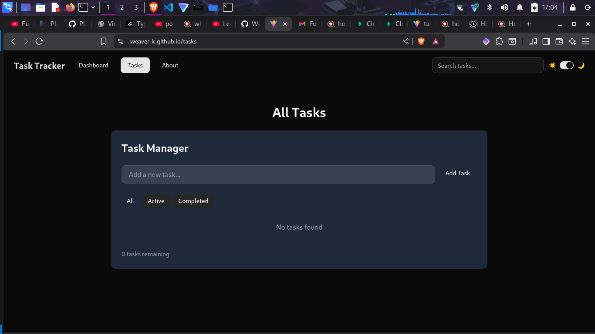
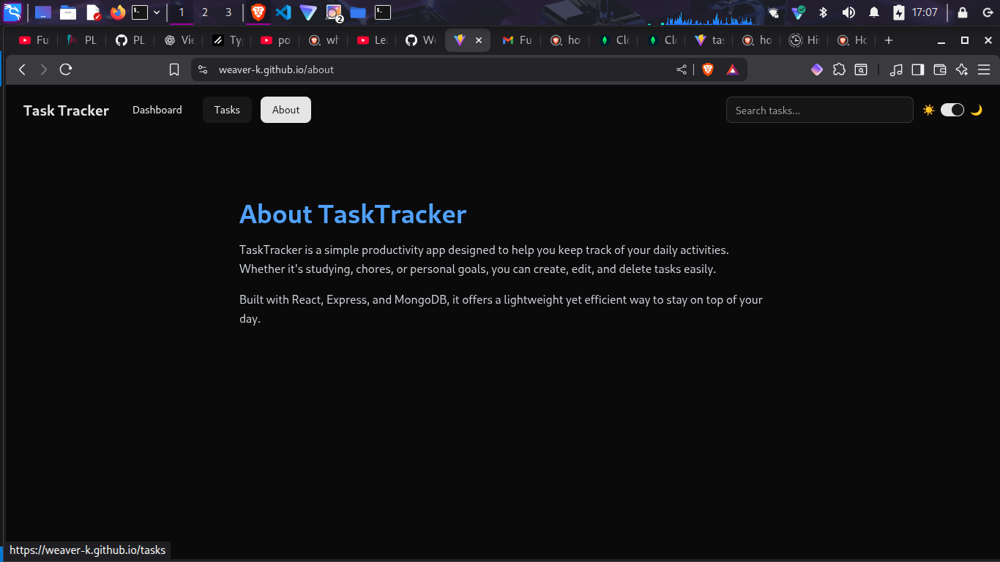

# 🧩 Task Manager App

A full-stack **personal task tracking app** built with **React (Vite)** for the frontend and **Express.js + MongoDB** for the backend.  
It allows users to add, delete, and manage tasks with a clean interface inspired by TailwindCSS and shadcn-ui components.

---

## 🚀 Features

- 📝 Add, edit, and delete tasks  
- ✅ Mark tasks as completed  
- 🔍 Filter tasks (all, active, completed)  
- 🌗 Dark / Light mode toggle  
- ⚡ Persistent storage (via localStorage or backend API)  
- 🧭 Responsive navigation bar with search and dropdown menu  
- 📄 Deployed frontend on **GitHub Pages**

---

## 🧱 Project Structure

Task-Manager/
├── backend/
│ ├── src/
│ │ ├── models/
│ │ │ └── task.js
│ │ ├── routes/
│ │ │ └── taskRoutes.js
│ │ └── server.js
│ └── package.json
│
├── src/
│ ├── components/
│ │ ├── TaskManager.jsx
│ │ ├── NavBar.jsx
│ │ └── ui/
│ │ ├── button.jsx
│ │ ├── footer.jsx
│ │ └── switch.jsx
│ ├── pages/
│ │ ├── Dashboard.jsx
│ │ ├── Tasks.jsx
│ │ └── About.jsx
│ ├── App.jsx
│ └── main.jsx
│
├── vite.config.js
├── tailwind.config.js
├── package.json
└── README.md

---

## ⚙️ Installation and Setup

### 1️⃣ Clone the repository
```zsh
git clone https://github.com/Weaver-K/Task-Manager.git
cd Task-Manager
```
2️⃣ Frontend Setup (React + Vite)
Install dependencies
```zsh
npm install
```
Run development server
```zsh
npm run dev
```

Then open:

http://localhost:5173/

Build for production
```zsh
npm run build
```
Preview production build locally
```zsh
npm run preview
```

### 3️⃣ Backend Setup (Express + MongoDB)

Navigate to your backend folder:
```zsh
cd backend
```
Install backend dependencies
```zsh
npm install
```
Configure your environment variables

Create a .env file in /backend:
```zsh
PORT=5000
MONGO_URI=mongodb://localhost:27017/taskdb
```
Start the backend server
```zsh
npm start
```

Your backend will run on:

http://localhost:5000/

🌐 Connecting Frontend and Backend

In your frontend, you can create a src/lib/api.js file to connect to the backend:
```zsh
const API_URL = "http://localhost:5000/api/tasks";

export async function fetchTasks() {
  const res = await fetch(API_URL);
  return res.json();
}

export async function createTask(task) {
  const res = await fetch(API_URL, {
    method: "POST",
    headers: { "Content-Type": "application/json" },
    body: JSON.stringify(task),
  });
  return res.json();
}
```

### Task Manager(FrontEnd)

This entails the app itself.

It is an app that monitors your tasks if pending or connected.

Here are the screenshots for them

#### App preview

Here is the link to my published project https://weaver-k.github.io/Task-Manager/

This is how you will probably see the first page which will directly lead you to the dashboard page


This is how it looks like in dark mode which can be toggled i the top right corner of the page


This is the tasks page which renders the tasks you currently have



This is page generally descrbes the page



In the dashboard you can create your tasks,edit or delete.

You can also mark them as completed and will be categorized as pending if not marked via the checkbox.


I

### 🚢 Deployment (GitHub Pages)

This project uses GitHub Actions to automatically deploy the frontend to GitHub Pages.

Manual Steps (if not automated)

Build your app:
```zsh
npm run build
```

Deploy using GitHub Actions workflow:

# .github/workflows/deploy.yml
name: Deploy Vite App to GitHub Pages
```yml
on:
  push:
    branches: [main]
  workflow_dispatch:

permissions:
  contents: write

jobs:
  build:
    runs-on: ubuntu-latest
    steps:
      - uses: actions/checkout@v4
        with:
          fetch-depth: 0

      - uses: actions/setup-node@v4
        with:
          node-version: 20

      - run: npm install
      - run: npm run build

      - uses: JamesIves/github-pages-deploy-action@v4
        with:
          branch: gh-pages
          folder: dist

```
Visit your deployed site at: https://<yourusername>.io/<your-repository>/


https://weaver-k.github.io/Task-Manager/

🧩 Technologies Used
Frontend

- React (Vite)

- React Router DOM

- TailwindCSS

- shadcn/ui components

- Framer Motion (for transitions)

- Lucide React icons

- Backend

- Express.js

- Mongoose (MongoDB)

- CORS

- dotenv

### 🧠  Possible Improvements

Add authentication (JWT)

Enable cloud persistence (MongoDB Atlas)

Improve accessibility and offline support (PWA)

### 👤 Author

Malcolm Keith Oyieke
📍 University of Nairobi
💻 GitHub Profile
Weaver-K

🪪 License

It isn't licenced yet

---